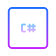

  

  

    
    
    
  

##  About me

My name is Louis-Guillaume MORAND, and I'm based in France working (currently) at Microsoft 

I'm a versatile Software Engineer with over 20 years of comprehensive experience, focused on working with challenging projects and learning while working. Playing with domotic, magic mirror, developing and using DevOps on daily basis, I spend most of my time in front of a code editor. I like to write technical articles or books. 

## 📘 My books

## 🔭 Some stuff I built/wrote

- [The AKS Checklist](http://www.the-aks-checklist.com), the best way to ensure your cluster is production-ready!
- [The Azure Container Apps workshop](https://aka.ms/aca-workshop)
- [The AKS workshop](https://aka.ms/aks-workshop)
- [The GitHub Copilot workshop](https://moaw.dev/workshop/github-copilot/)
- [Azure DevOps - pipelines decorators whitepaper](https://github.com/lgmorand/azure-devops-pipeline-decorators)
- [The DevSecOps table](https://aka.ms/devsecops-table)
- A certification guide for GitHub

## 🧠 I love using this 

  &nbsp;
  &nbsp;
  &nbsp;
  &nbsp;
  &nbsp;
  &nbsp;
  &nbsp;
  &nbsp;
  &nbsp;
  

## 🙌🏼 My stats 

